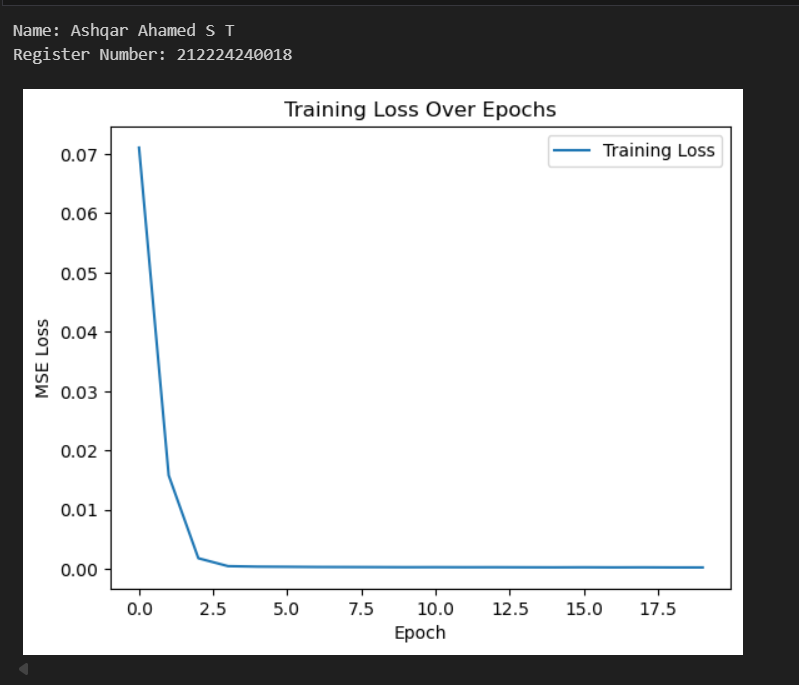
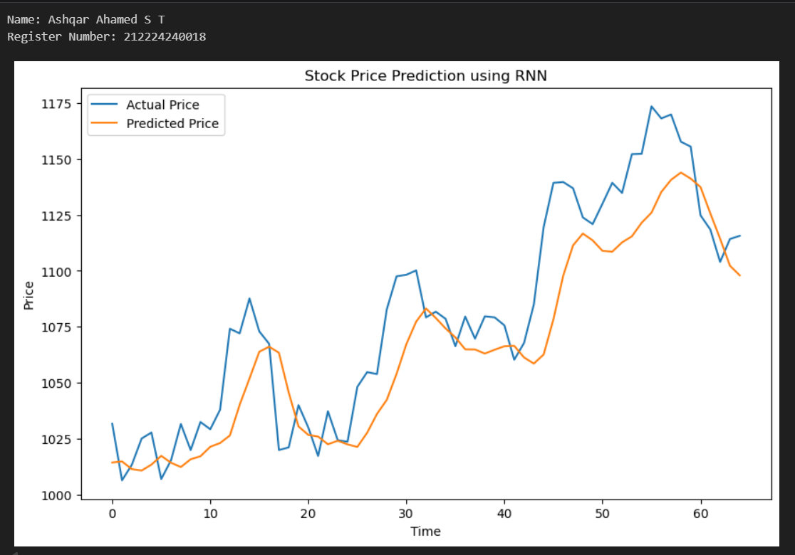
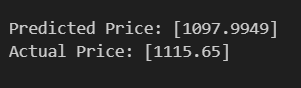

# Stock-Price-Prediction

## AIM

To develop a Recurrent Neural Network model for stock price prediction.

## Problem Statement and Dataset

The objective is to implement a Recurrent Neural Network model for stock price prediction, In this case, Choose the 'close' feature to apply to model. Display the Validation loss graph and also a graph for the actual values and predicted values


## Design Steps

### Step 1:
Import the necessary libraries.

### Step 2:
Load the dataset and use DataLoader to batch the dataset4

### Step 3:
Create a class to define the Recurrent Neural Network, in the class define the forward function

### Step 4:
Initialize the model and get a model summary

### STEP 5:
Initialize the loss function MSELoss and Optimizier

### STEP 6:
Create a function to train the model and call it to train the model.

### STEP 7:
Test the model using the test_loader.

### Step 8:
Display the results.


## Program
#### Name: Ashqar Ahamed S T
#### Register Number: 212224240018

```Python 
# Define RNN Model
class RNNModel(nn.Module):
    def __init__(self, input_size=1, hidden_size=64, output_size=1, num_layers=2):
      super(RNNModel,self).__init__()
      self.rnn = nn.RNN(input_size, hidden_size, num_layers,batch_first=True)
      self.fc = nn.Linear(hidden_size, output_size)

    def forward(self, x):
      out, _ = self.rnn(x)
      out = self.fc(out[:, -1, :])
      return out

mode_Ashqar = RNNModel()
criterion = nn.MSELoss()
optimizer = optim.Adam(model_Ashqar.parameters().lr=0.001)


# Train the Model
epochs = 20
model_Ashqar.train()
train_losses = []
for epoch in range(epochs):
    running_loss = 0.0
    for x_batch, y_batch in train_loader:
        x_batch, y_batch = x_batch.to(device), y_batch.to(device)
        optimizer.zero_grad()

        outputs = model_Ashqar(x_batch)
        loss = criterion(outputs, y_batch)
        loss.backward()
        optimizer.step()
        running_loss += loss.item()

    train_losses.append(running_loss / len(train_loader))
    print(f"Epoch [{epoch+1}/{epochs}], Loss: {train_losses[-1]:.4f}")

```

## Output

### Trianing Loss:



### True Stock Price, Predicted Stock Price vs time



### Predictions 



## Result
Thus, A Recurrent Neural Network model is implemented successfully to predict the stock prices. 

